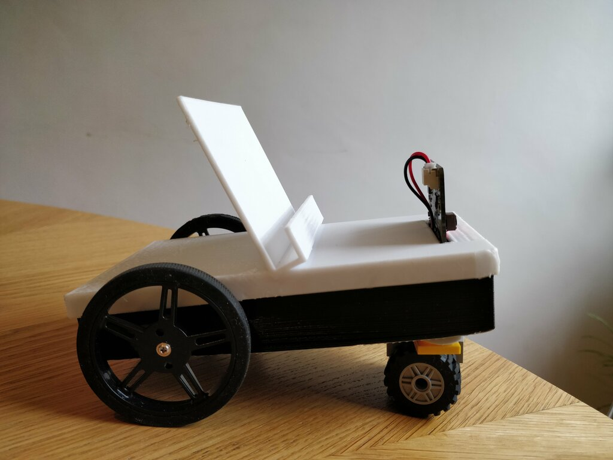
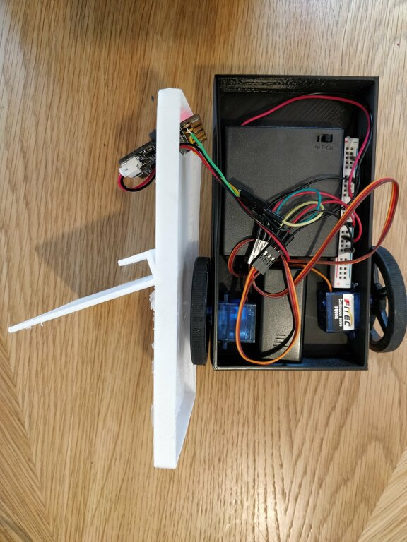

# robophone

This project is a DIY smartphone telepresence kit!

 - a 3d-printed robotic smartphone holder
 - a web app for a single remote user that does:
   - video calling to the phone over WebRTC
   - face detection and cropping of the remote user to fill the phone screen
   - allows the remote caller to drive the robot 

There's no need to wire anything into the phone or even install an app - just sit the phone on top of the robot, pair it with Bluetooth, and open the web app in the phone browser.

## How it works - Overview

The chassis contains powered motors controlled from a BBC microbit.

The smartphone sits on top of the chassis and talks to the microbit using Bluetooth.

A Vue.js web app runs on both the phone browser and the remote user's browser.  (The phone browser needs to support Web Bluetooth - Chromium for Android worked fine.  The remote user just needs WebRTC - Chrome or Firefox both fine.)

The Vue.js app uses WebRTC to connect together the remote user and phone webcam/mics for videocalling.  (You will likely need to run a TURN server to relay the connection, if the user and phone and on separate networks.)

Additionally, the remote user's browser detects faces (using face-api.js which uses tensorflow.js to run a convolutional neural net in the browser) and crops the video stream to the face alone - this just looks better, as it fills the phone screen nicely!

## What you need

Parts:
 - A BBC Microbit
   - https://shop.4tronix.co.uk/collections/bbc-micro-bit/products/bbc-micro-bit-in-gift-box-microbit 
 - A pair of FS90R servos with wheels
   - https://www.pololu.com/product/4910
   - https://www.pololu.com/product/2820
 - Battery holders (2xAAA for the microbit and 4xAA for the motors)
   - https://shop.4tronix.co.uk/collections/bbc-micro-bit/products/mbit_aaa
 - Connectors, etc. for wiring it up
 - Some kind of front wheel and fixing (I used Lego parts)

You will also need:
 - A 3d printer to make the chassis (I used an Ender 3)
 - A publically accessible server with a valid HTTPS certificate from which to serve the app (I used a low-powered Ubuntu server with LetsEncrypt, you can use AWS or similar too.)

## Technologies

Hardware:

 - BBC Microbit controller drives a pair of FS90R continuous servos
 - A smartphone with Bluetooth and a Chrome derived browser that runs Web Bluetooth
 - A 3d printed chassis
 
Software:
 - A Vue.js app (runs on the browser on both the phone and remote user's laptop, etc.) 

## Using the app

Flash the microbit, and set up the server as described below.  I'll assume the address is `https://robophone.example.com`.

 - Power on the chassis (microbit and servos)
 - On the phone, use Chrome or other Chromium browser, visit  `https://robophone.example.com/robot`
     - Click the `FIND` button, and pair it with the Microbit from the list of Bluetooth devices
     - Click `CONNECT` to open the WebRTC connection
     - Optionally press `fullscreen` to make the remote video fill the screen.  It might appear blank until the remote user connects.
     
 - On the remote browser (a laptop with webcam works well), open a browser and browse to `https://robophone.example.com/`
    - You should see some buttons, and your own webcam image, with a rectangle highlighting your face
    - Click the `CONNECT` button below the image
    - You should see the remote camera image appear above your own
    - You should now be able to use the on screen navigation buttons and/or the arrow keys to drive the phone!
    
    
### Caveats

- Take care of your phone - don't let the remote driver crash it off a table!  Put it on the floor, or be ready to catch it.  (Owner's risk!)

## Setup 

### Printing and assembling the chassis

- Chassis designed in OpenSCAD, and exported as two STL files
- Print on a 3d printer
  - (I sliced these with Cura with a coarse 0.4mm layer height and printed them on an Ender 3)
  - (They were quite fast to print, approx 1.5hr each, but not very strong.)
- Insert and wire up the components
  - (Best to use a separate battery pack for the servos to avoid overloading the microbit power supply)
  - Connect the servo drive pins to the Microbit GPIO pins 0 and 2
  - If you change the pins, change `LocalDrive.vue` to match
  - You can use crocodile clips, etc. to prototype, but there's not much room in the chassis for crocodile clips - I soldered them to save space
  - I used a narrow breadboard track and Dupont crimper to fit the rest together, and insert the servos and battery packs in the chassis.

- Screw the wheels into the servos
- Fit a front wheel
  - (I used sticky velcro tape to fit a Lego piece, then stuck on a Lego turntable and small wheel.  Lots of room for improvement)
  
### Flashing the microbit

 - Import the `microbit-makecode.js` file into the https://makecode.microbit.org/ site
 - Build this to get a `.hex` file
 - Connect the microbit to your PC with a micro USB cable - it appears as a USB storage device
 - Copy the `.hex` file to this location to flash the microbit.
 
(The microbit sketch just enables the Bluetooth IO Pin service, to allow paired bluetooth devices to control the servos connected to the IO Pins)

#### Microbit pairing issues
 - Put the microbit in pairing mode: hold down the two front buttons A and B, then press/release the Reset button on the back
 - The microbit should show a smiley face when connected 
 - (If you have problems it might help to visit Bluetooth Settings on the phone, forget the microbit, and re-pair

### Running the server

There are three server processes to run:

 - The Vue app (just serves the front end to the clients)
 - The node.js "signalling server" (tells the clients how to find each other)
 - The TURN server (may be needed to relay the video call connection between networks)

The WebRTC protocol is rightly fussy about security, so the app has to be served with a valid HTTPS certificate - we can use LetsEncrypt to obtain this for free.

We'll use the `coturn` TURN server, which we can run from Docker using the scripts here: `https://github.com/meetrix/coturnDockerLongTermCredentials`

So there are several steps to the process:
 - Use LetsEncrypt `certbot` or similar, to make a valid SSL certificate
 - Check out the `coturn` server Docker repo
   - run the ``genpass.sh` script to create a username/password
   - Update the `PeerConnect.vue` file to give the public URL of the TURN server, the username and credential
 - Use `npm run serve` to start the Vue app server.
   - Set environment variables to configure it:
     - `ROBOPHONE_PUBLIC_URL` should be the hostname (and port if nonstandard) where the app will be served, which should match the SSL certificate. E.g. `robophone.yourdomain.com:8080`
     - `ROBOPHONE_SSL_PATH` - the path to the SSL certificate directory containing `.pem` files, e.g. as created by LetsEncrypt.
     - `ROBOPHONE_USERNAME` and `ROBOPHONE_PASSWORD` - choose a username/password pair that you will provide to your users, to allow them to connect via HTTPS basic authentication
 - Use `node signalling_server/index.js` to start the signalling server

You should be ready to go!

## Future improvements?

- The chassis would benefit from a redesign:
  - Make it stronger and slightly more roomy
  - Print internal mounting guides so the servos stay in place better
  - Improve the connection of the front wheel
  - Needs an externally accessible power switch for both battery packs
  
- It would be great to redesign the chassis to allow the phone to be tilted forward and back with a third servo!

- Packaging up the server with Docker to make it easier to deploy

## Credits
Thanks to these great projects!
 
 - https://github.com/justadudewhohacks/face-api.js/
 - https://github.com/thegecko/microbit-web-bluetooth
 
 - BBC microbit 
 - vue.js / vuetify

